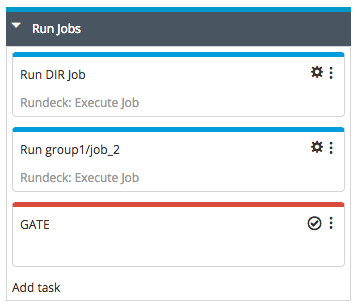
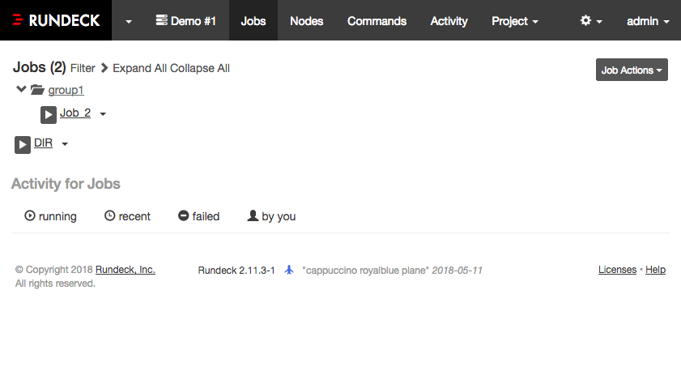
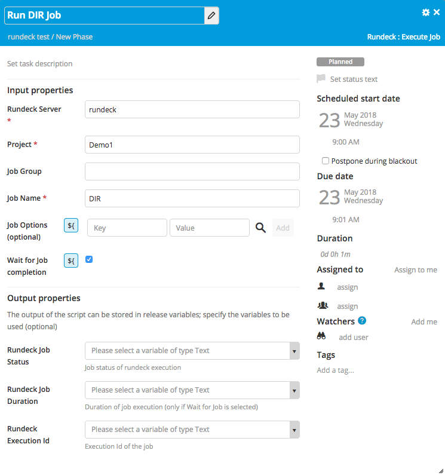
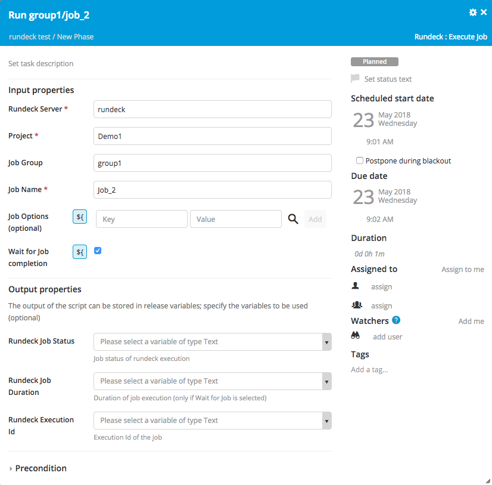

# Build Status

[![Build Status][xlr-rundeck-plugin-travis-image] ][xlr-rundeck-plugin-travis-url]
[![Codacy][xlr-rundeck-plugin-codacy-image] ][xlr-rundeck-plugin-codacy-url]
[![Code Climate][xlr-rundeck-plugin-code-climate-image] ][xlr-rundeck-plugin-code-climate-url]
[![License: MIT][xlr-rundeck-plugin-license-image] ][xlr-rundeck-plugin-license-url]
[![Github All Releases][xlr-rundeck-plugin-downloads-image] ]()

[xlr-rundeck-plugin-travis-image]: https://travis-ci.org/xebialabs-community/xlr-rundeck-plugin.svg?branch=master
[xlr-rundeck-plugin-travis-url]: https://travis-ci.org/xebialabs-community/xlr-rundeck-plugin
[xlr-rundeck-plugin-codacy-image]: https://api.codacy.com/project/badge/Grade/b4b6dbd57edb4344b4e32dfc76025422
[xlr-rundeck-plugin-codacy-url]: https://www.codacy.com/app/zvercodebender/xlr-rundeck-plugin
[xlr-rundeck-plugin-code-climate-image]: https://codeclimate.com/github/xebialabs-community/xlr-rundeck-plugin/badges/gpa.svg
[xlr-rundeck-plugin-code-climate-url]: https://codeclimate.com/github/xebialabs-community/xlr-rundeck-plugin
[xlr-rundeck-plugin-license-image]: https://img.shields.io/badge/License-MIT-yellow.svg
[xlr-rundeck-plugin-license-url]: https://opensource.org/licenses/MIT
[xlr-rundeck-plugin-downloads-image]: https://img.shields.io/github/downloads/xebialabs-community/xlr-rundeck-plugin/total.svg

# Preface
The document describes the functionality provided by the xlr-rundeck-plugin.  This plugin is to trigger *Rundeck* jobs from XL Release.

# Requirements

* XL Release 5.0.1+
* Additional Runtime Libraries
	* *rundeck-api-java-client-13.1.jar*
	        

# Installation

1. Place the plugin JAR file into your `XL_RELEASE_HOME/plugins` directory.   
2. Copy the following jar's from the `src/client/`, and put them under `XL_RELEASE_HOME/lib`:
	* `rundeck-api-java-client-13.1.jar`

Make sure you have additional runtime libraries mentioned in the requirements section also installed in the correct directory.

# Interfaces

## Example Run Deck Project

## Running a Job that is not in a group

## Running a Job that is in a group

